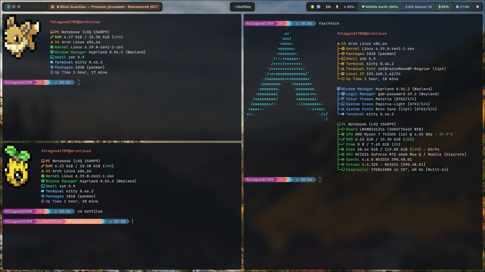
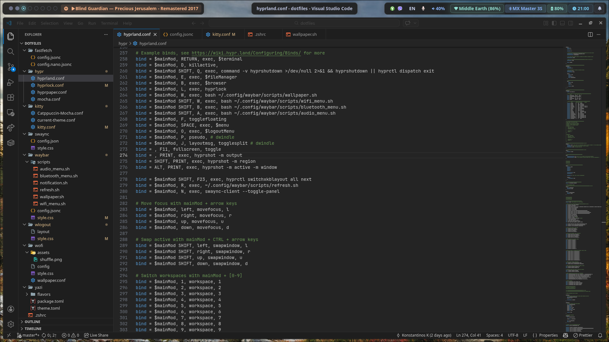
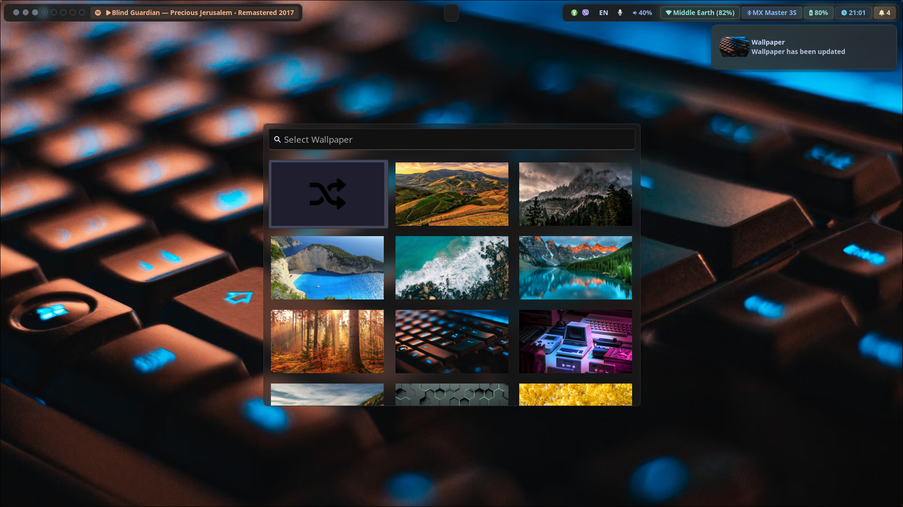
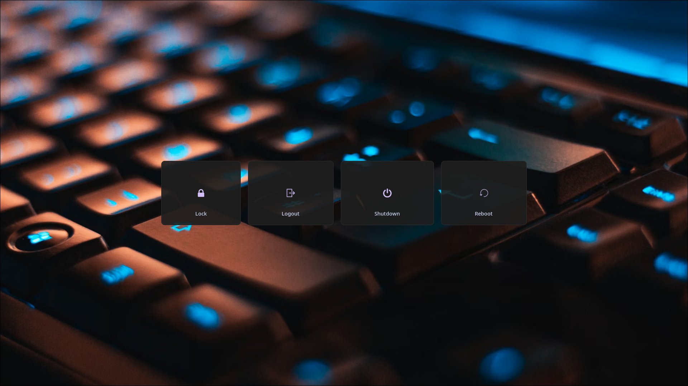

# dotfiles

My personal dotfiles for a Hyprland-based desktop on Arch Linux.

## Screenshots






## Overview

| Component         | Tool                                          |
|-------------------|-----------------------------------------------|
| Window Manager    | [Hyprland](https://hyprland.org/)             |
| Shell             | Zsh                                           |
| Prompt            | [Starship](https://starship.rs/)              |
| Terminal          | [Kitty](https://sw.kovidgoyal.net/kitty/)     |
| Bar               | [Waybar](https://github.com/Alexays/Waybar)   |
| App Launcher      | [Wofi](https://hg.sr.ht/~scoopta/wofi)        |
| Notifications     | [SwayNC](https://github.com/ErikReider/SwayNotificationCenter) |
| Lock Screen       | [Hyprlock](https://github.com/hyprwm/hyprlock) |
| Wallpaper         | [Waypaper](https://github.com/anufrievroman/waypaper) / [swww](https://github.com/LGFae/swww) |
| File Manager      | Nautilus (GUI) / [Yazi](https://yazi-rs.github.io/) (terminal) |
| System Info       | [Fastfetch](https://github.com/fastfetch-cli/fastfetch) + [Pokemon Color Scripts](https://gitlab.com/phoneybadger/pokemon-colorscripts) |
| Logout Menu       | [Wlogout](https://github.com/ArtsyMacaw/wlogout) |
| Editor            | Neovim                                        |
| Browser           | Firefox                                       |
| Screenshots       | [Hyprshot](https://github.com/Gustash/hyprshot) |
| AUR Helper        | [paru](https://github.com/Morganamilo/paru)   |

## Theme

**Catppuccin Mocha** across the entire desktop (Hyprland, Kitty, Waybar, Wofi, SwayNC, Hyprlock, Wlogout).  
**Dracula** for Yazi.

### Fonts

- **JetBrainsMono Nerd Font** — Kitty terminal
- **Cascadia Code Nerd Font** — Waybar, Wofi, SwayNC, Hyprlock

## Keybindings

`$mainMod` = **Super** (Windows key)

### General

| Keybind | Action |
|---------|--------|
| `Super + Return` | Open terminal (Kitty) |
| `Super + Space` | App launcher (Wofi) |
| `Super + D` | Close active window |
| `Super + F` | Toggle floating |
| `Super + P` | Toggle pseudotile |
| `Super + J` | Toggle split direction |
| `F11` | Toggle fullscreen |
| `Super + Shift + Q` | Exit Hyprland |

### Apps

| Keybind | Action |
|---------|--------|
| `Super + B` | Browser (Firefox) |
| `Super + E` | File manager (Nautilus) |
| `Super + L` | Lock screen (Hyprlock) |
| `Super + O` | Logout menu (Wlogout) |
| `Super + N` | Toggle notification panel (SwayNC) |
| `Super + R` | Refresh Waybar |
| `Super + W` | Change wallpaper |
| `Super + Shift + W` | Wi-Fi menu |
| `Super + Shift + B` | Bluetooth menu |
| `Super + Shift + A` | Audio menu |

### Screenshots

| Keybind | Action |
|---------|--------|
| `Print` | Screenshot of entire output |
| `Shift + Print` | Screenshot of selected region |
| `Alt + Print` | Screenshot of active window |

### Focus & Windows

| Keybind | Action |
|---------|--------|
| `Super + Arrow keys` | Move focus |
| `Super + Shift + Arrow keys` | Swap windows |
| `Super + LMB drag` | Move window |
| `Super + RMB drag` | Resize window |

### Workspaces

| Keybind | Action |
|---------|--------|
| `Super + 1–0` | Switch to workspace 1–10 |
| `Super + Shift + 1–0` | Move window to workspace 1–10 |
| `Super + S` | Toggle scratchpad |
| `Super + Shift + S` | Move window to scratchpad |
| `Super + Scroll` | Cycle through workspaces |

### Media & System

| Keybind | Action |
|---------|--------|
| `XF86AudioRaiseVolume` | Volume up 5% |
| `XF86AudioLowerVolume` | Volume down 5% |
| `XF86AudioMute` | Toggle mute |
| `XF86AudioMicMute` | Toggle mic mute |
| `XF86MonBrightnessUp` | Brightness up 5% |
| `XF86MonBrightnessDown` | Brightness down 5% |
| `XF86AudioPlay/Pause` | Play/Pause |
| `XF86AudioNext` | Next track |
| `XF86AudioPrev` | Previous track |

## Directory Structure

```
dotfiles/
├── fastfetch/          # Fastfetch config (full & nano variants)
├── hypr/               # Hyprland, Hyprlock configs + Catppuccin Mocha palette
├── kitty/              # Kitty terminal + Catppuccin Mocha theme
├── swaync/             # SwayNC notification center config & style
├── waybar/             # Waybar config, style, and scripts
│   └── scripts/        # Audio, Bluetooth, Wi-Fi, wallpaper & notification scripts
├── wlogout/            # Wlogout layout & style
├── wofi/               # Wofi launcher config & style
├── yazi/               # Yazi file manager theme (Dracula)
│   └── flavors/
│       └── dracula.yazi/
├── starship.toml       # Starship prompt config
└── README.md
```

## Waybar Scripts

Custom scripts in `waybar/scripts/` used by Hyprland keybindings and the Waybar module bar.

### `audio_menu.sh`

A Wofi-based audio output switcher powered by `pactl`.

- Lists all PulseAudio sinks with device icons (Bluetooth, HDMI, headphones, speakers), current volume, and mute state
- Marks the currently active sink with a filled icon prefix (``)
- **Toggle Mute** — mutes/unmutes the default sink and sends a desktop notification
- **Open Pavucontrol** — launches the full PulseAudio volume control GUI
- Selecting a sink sets it as the default and moves all active sink inputs to it
- Requires: `pactl`, `wofi`, `pavucontrol` (optional)

### `bluetooth_menu.sh`

A Wofi-based Bluetooth manager powered by `bluetoothctl`.

- Shows connected devices (marked with ``) before paired-but-disconnected ones, deduplicating the list
- Displays battery percentage for connected devices when available
- **Toggle Bluetooth On/Off** — powers the adapter and notifies
- Selecting a connected device disconnects it; selecting a disconnected device connects it (with a 10-second timeout)
- Requires: `bluetoothctl`, `wofi`, `bluetui` (optional, for the TUI)

### `wifi_menu.sh`

A Wofi-based Wi-Fi manager powered by `nmcli`.

- Scans and lists available networks with signal-strength icons (󰤨 󰤥 󰤢 󰤟 󰤯) and signal percentage
- Marks the currently connected network with a `✓` prefix
- **Toggle Wi-Fi On/Off** — enables/disables the radio and notifies
- **Rescan Networks** — triggers a fresh scan without closing the menu
- Connecting to a known network uses the saved credentials; unknown networks prompt for a password via a second Wofi prompt
- Requires: `nmcli`, `wofi`

### `wallpaper.sh`

A Wofi-based wallpaper picker, adapted from [highonskooma/Wofi-Wallpaper-Picker](https://github.com/highonskooma/Wofi-Wallpaper-Picker/blob/master/wofi-wallpaper-selector.sh).

- Reads wallpapers from `~/Pictures/wallpapers` (jpg, jpeg, png)
- Generates and caches `250×141` thumbnails with `imagemagick` (`magick`) so the picker loads instantly after the first run
- Displays a 3-column thumbnail grid in Wofi with a **Random Wallpaper** shuffle option at the top (uses `wofi/assets/shuffle.png` as its icon)
- Supports a `--random` flag to skip the picker and set a random wallpaper directly (used for scripted rotation)
- After selection, applies the wallpaper with `swww img -t grow` and keeps the rest of the desktop in sync:
  - Updates `~/.config/wlogout/style.css` (background image)
  - Updates `~/.config/hypr/hyprlock.conf` (lock screen background)
  - Saves the path to `~/.cache/current_wallpaper`
  - Sends a desktop notification with the wallpaper thumbnail
- Requires: `swww`, `wofi`, `imagemagick`, `notify-send`

## Shell

Zsh with:
- [zsh-autosuggestions](https://github.com/zsh-users/zsh-autosuggestions)
- [fzf](https://github.com/junegunn/fzf) shell integration
- Starship prompt
- Fastfetch on shell start (nano config with a random Pokémon color script)

## Installation

Clone the repo and symlink (or copy) the relevant directories to `~/.config/`:

```sh
git clone https://github.com/<your-username>/dotfiles.git ~/dotfiles
```

Then link each component, for example:

```sh
ln -s ~/dotfiles/hypr ~/.config/hypr
ln -s ~/dotfiles/kitty ~/.config/kitty
ln -s ~/dotfiles/waybar ~/.config/waybar
# ... etc.
```
